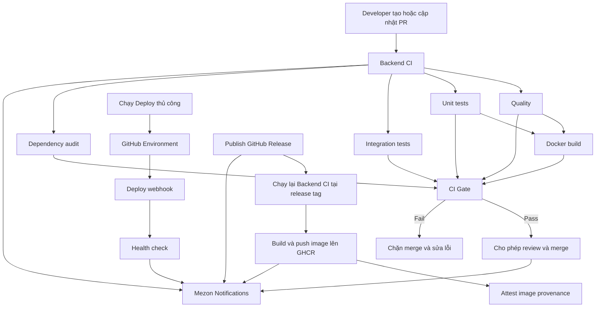

# Hướng dẫn GitHub Actions, CI/CD và thông báo Mezon

Tài liệu này mô tả toàn bộ hệ thống kiểm tra Pull Request, release, deploy và thông báo
Mezon đã được triển khai cho `nexora-be`.

Mục tiêu chính:

- Phát hiện sớm lỗi format, lint, type, build, migration, test và Docker trước khi merge.
- Tạo một trạng thái tổng hợp ổn định để bảo vệ nhánh `main` và `dev`.
- Kiểm tra lại chính xác source của release trước khi publish container image.
- Chuẩn bị luồng deploy an toàn bằng GitHub Environments.
- Gửi trạng thái PR, review, CI, release và deploy về một Mezon channel.
- Đồng bộ môi trường phát triển quanh Node.js 22 và Yarn 1.22.22.

## 1. Kiến trúc tổng thể



`CI Gate` là check tổng hợp cuối cùng. Branch protection chỉ cần yêu cầu check này thay vì
phải cấu hình riêng từng job nội bộ.

## 2. Các file đã triển khai

| File                                     | Vai trò                                                          |
| ---------------------------------------- | ---------------------------------------------------------------- |
| `.github/workflows/ci.yml`               | Kiểm tra PR, push, source release và hỗ trợ chạy thủ công        |
| `.github/workflows/mezon-notify.yml`     | Gửi sự kiện GitHub về Mezon                                      |
| `.github/workflows/release.yml`          | Xác minh release và publish image lên GHCR                       |
| `.github/workflows/deploy.yml`           | Deploy thủ công qua GitHub Environment và deploy webhook         |
| `.github/dependabot.yml`                 | Tạo PR cập nhật dependency và GitHub Actions hằng tuần           |
| `.github/pull_request_template.md`       | Checklist chuẩn khi tạo PR                                       |
| `.github/scripts/check-node-version.cjs` | Kiểm tra Node.js 22 trước khi push                               |
| `.github/WORKFLOW_SETUP.md`              | Checklist cấu hình GitHub/Mezon ngắn gọn                         |
| `.github/WORKFLOW_GUIDE.vi.md`           | Tài liệu chi tiết này                                            |
| `lefthook.yml`                           | Kiểm tra local trước commit và push                              |
| `Dockerfile`                             | Production image dùng Node 22 và Yarn 1 theo mô hình multi-stage |
| `package.json`                           | Pin package manager/runtime và đặt coverage threshold            |

Ngoài ra còn có một số chỉnh sửa hỗ trợ cho health endpoint, cấu hình e2e và format source
để toàn bộ pipeline chạy ổn định trên source hiện tại.

## 3. Chuẩn runtime và package manager

Project sử dụng:

```text
Node.js: 22.x
Yarn: 1.22.22
Lockfile: yarn.lock
```

Các lớp bảo vệ hiện có:

- `packageManager` trong `package.json` khai báo `yarn@1.22.22`.
- `engines` yêu cầu Node.js 22 và Yarn 1.22.x.
- Cấu hình `volta` giúp máy có Volta tự chọn đúng phiên bản.
- Máy không có Volta vẫn hoạt động bình thường bằng nvm, fnm, asdf hoặc Node cài thủ công.
- Local Git hook không phụ thuộc vào Corepack, npm, Yarn global hoặc Volta. Hook gọi trực tiếp
  CLI đã cài trong `node_modules`.
- GitHub Actions chủ động chuẩn bị Yarn 1.22.22 bằng Corepack trong runner do workflow quản lý.

Nếu máy local không dùng Corepack, có thể cài Yarn 1 bằng cách khác, ví dụ:

```bash
npm install --global yarn@1.22.22
yarn install --frozen-lockfile
```

Corepack chỉ là một lựa chọn:

```bash
corepack enable
corepack prepare yarn@1.22.22 --activate
yarn install --frozen-lockfile
```

Không nên tạo hoặc commit `package-lock.json` vì source này lấy `yarn.lock` làm lockfile chuẩn.

## 4. Workflow Backend CI

File: `.github/workflows/ci.yml`

### 4.1. Khi nào workflow chạy?

| Sự kiện             | Điều kiện                                                    |
| ------------------- | ------------------------------------------------------------ |
| `pull_request`      | PR vào `main` hoặc `dev`                                     |
| PR actions          | `opened`, `synchronize`, `reopened`, `ready_for_review`      |
| `push`              | Push trực tiếp hoặc merge vào `main` hoặc `dev`              |
| `workflow_call`     | Được workflow Release tái sử dụng để kiểm tra một tag cụ thể |
| `workflow_dispatch` | Chạy thủ công từ tab Actions                                 |

Khi có commit mới trên cùng PR, `concurrency` hủy lượt CI cũ và chỉ giữ lượt mới nhất. Điều
này tránh tốn runner cho source đã lỗi thời.

Workflow mặc định chỉ có quyền đọc source:

```yaml
permissions:
  contents: read
```

### 4.2. Job `Quality`

Timeout: 10 phút.

Các bước:

1. Checkout đúng commit/ref cần kiểm tra.
2. Cài Node.js 22 và bật Yarn cache theo `yarn.lock`.
3. Kích hoạt Yarn 1.22.22.
4. Cài dependency bằng `yarn install --frozen-lockfile --ignore-scripts`.
5. Generate Prisma Client.
6. Chạy `yarn biome ci .` trên toàn bộ repository.
7. Validate `prisma/schema.prisma`.
8. Type-check source và unit test bằng TypeScript.
9. Build NestJS application.

Job này phát hiện:

- Source chưa format.
- Lỗi lint hoặc import ordering.
- Prisma schema không hợp lệ.
- Prisma Client chưa tương thích với schema.
- TypeScript error.
- NestJS production build error.
- Lockfile không khớp `package.json`.

`--frozen-lockfile` bảo đảm CI không tự sửa lockfile. Nếu dependency thay đổi mà `yarn.lock`
chưa được cập nhật, CI sẽ fail.

### 4.3. Job `Unit tests`

Timeout: 15 phút.

Job này:

1. Chuẩn bị Node/Yarn và dependency độc lập.
2. Generate Prisma Client.
3. Chạy toàn bộ unit test tuần tự với coverage.
4. Upload thư mục `coverage/` thành GitHub Actions artifact.

Coverage artifact được giữ 14 ngày, kể cả khi test fail, để reviewer có thể tải về kiểm tra.

Coverage threshold hiện tại:

| Metric     | Ngưỡng tối thiểu |
| ---------- | ---------------: |
| Statements |              10% |
| Branches   |               7% |
| Functions  |               7% |
| Lines      |              10% |

Đây là baseline phù hợp với coverage hiện tại. Có thể tăng dần khi bổ sung test; không nên giảm
threshold chỉ để làm CI pass.

### 4.4. Job `Integration tests`

Timeout: 20 phút.

GitHub tạo hai service container tạm thời:

- PostgreSQL `16-alpine`.
- Redis `7-alpine`.

Luồng kiểm tra:

1. Đợi PostgreSQL và Redis healthy.
2. Cài dependency và generate Prisma Client.
3. Chạy toàn bộ migration bằng `prisma migrate deploy`.
4. Khởi động Nest application trong test.
5. Chạy e2e test tuần tự với `--detectOpenHandles`.

Các giá trị JWT, Google, Cloudinary và Gemini trong job là dữ liệu giả dành riêng cho CI. Chúng
không phải production secret và không gọi dịch vụ production trong các test hiện tại.

Job integration xác minh được:

- Migration có thể apply từ database trống.
- Prisma schema và migration không lệch nhau.
- Application module có thể khởi tạo với PostgreSQL/Redis.
- API versioning và global prefix hoạt động.
- Endpoint đăng ký và health endpoint phản hồi đúng.
- Test không để lại open handle bất thường.

### 4.5. Job `Dependency audit`

Timeout: 10 phút.

Job chạy:

```bash
yarn audit --groups dependencies --json
```

Chính sách hiện tại:

- Chỉ audit production dependencies.
- Hiển thị số advisory mức `high`.
- Chặn CI nếu có advisory mức `critical`.
- Chặn CI nếu Yarn không trả về audit summary hợp lệ.

Các advisory mức `high` vẫn cần được theo dõi và xử lý qua Dependabot, nhưng chưa chặn toàn bộ
team trong khi source đang có dependency cũ. Khi backlog dependency đã được xử lý, policy có thể
được nâng lên để chặn cả `high`.

### 4.6. Job `Docker build`

Timeout: 20 phút.

Job chỉ bắt đầu sau khi `Quality` và `Unit tests` pass. Nó:

- Khởi tạo Docker Buildx.
- Build production image từ `Dockerfile`.
- Không push image.
- Dùng GitHub Actions cache để tăng tốc các lần chạy sau.

Job này bắt được lỗi mà TypeScript build đơn thuần không thấy, ví dụ:

- Docker stage sai.
- Thiếu file trong build context.
- Dependency production không đủ.
- Prisma Client không được copy đúng vào final image.
- Lỗi user/permission hoặc entrypoint trong container.

### 4.7. Job `CI Gate`

`CI Gate` luôn chạy sau tất cả job, kể cả khi một job trước đó fail hoặc bị cancel.

Nó kiểm tra kết quả của:

- `Quality`.
- `Unit tests`.
- `Integration tests`.
- `Dependency audit`.
- `Docker build`.

Nếu bất kỳ job nào có trạng thái `failure`, `cancelled` hoặc `skipped`, `CI Gate` sẽ fail.

Đây là check nên được chọn trong GitHub branch protection:

```text
CI Gate
```

## 5. Luồng Pull Request

Luồng chuẩn:

1. Developer tạo branch từ `main` hoặc `dev` đúng với mục tiêu PR.
2. Local pre-commit hook kiểm tra các file staged.
3. Local pre-push hook kiểm tra Node, generate Prisma và build.
4. Developer push branch và tạo PR.
5. `Backend CI` chạy toàn bộ quality, test, audit và Docker build.
6. Mezon nhận thông báo PR được tạo.
7. Reviewer approve, request changes hoặc comment.
8. Mezon nhận trạng thái review.
9. Chỉ merge khi `CI Gate` pass và toàn bộ conversation đã resolved.
10. Sau merge, CI chạy lại trên nhánh đích để xác minh trạng thái cuối cùng.

Khi push commit mới vào PR:

- Event `synchronize` kích hoạt CI mới.
- CI cũ của PR bị cancel.
- Approval cũ có thể bị dismiss nếu branch ruleset bật tùy chọn này.

## 6. Local Git hooks

File: `lefthook.yml`

### 6.1. Pre-commit

Chỉ kiểm tra các file staged có định dạng:

```text
ts, tsx, js, jsx, cjs, mjs, json
```

Biome được gọi trực tiếp từ:

```text
node_modules/@biomejs/biome/bin/biome
```

Hook có thể tự sửa format và stage lại file đã sửa. Nó không yêu cầu Corepack hay Yarn global.

### 6.2. Pre-push

Hook chạy theo thứ tự:

1. Kiểm tra runtime là Node.js 22.x.
2. Generate Prisma Client từ schema hiện tại.
3. Build NestJS bằng local CLI.

Các CLI được gọi trực tiếp từ `node_modules`, vì vậy không phụ thuộc npm/Yarn/Corepack/Volta
trong lúc hook chạy.

Nếu dev đang dùng sai Node version, hook trả về một lỗi ngắn:

```text
[pre-push] Node.js 22.x is required; current runtime is vX.Y.Z.
```

Dev vẫn cần chạy `yarn install` ít nhất một lần để có `node_modules` và Lefthook.

## 7. Thông báo Mezon

File: `.github/workflows/mezon-notify.yml`

### 7.1. Secret cần cấu hình

Tạo repository secret:

```text
MEZON_WEBHOOK_URL
```

Đường dẫn trên GitHub:

```text
Repository
→ Settings
→ Secrets and variables
→ Actions
→ New repository secret
```

Giá trị secret là URL webhook lấy từ Mezon channel:

```text
Mezon channel
→ Edit Channel
→ Integrations
→ New Webhook
```

Không đưa URL này vào source, repository variable, issue, PR comment hoặc log.

### 7.2. Những sự kiện được gửi

| Nhóm         | Sự kiện                                                                |
| ------------ | ---------------------------------------------------------------------- |
| Pull Request | Opened, reopened, ready for review, converted to draft, closed, merged |
| Review       | Approved, changes requested, commented, dismissed                      |
| CI           | Backend CI completed                                                   |
| Release      | GitHub Release published và Release workflow completed                 |
| Deployment   | Success, failure, error hoặc inactive                                  |

Nội dung thông báo có thể bao gồm:

- Repository.
- PR number và title.
- Source branch và target branch.
- Người tạo PR hoặc thực hiện action.
- Reviewer và review state.
- Workflow name, run number, branch và conclusion.
- Release tag và release URL.
- Environment và deployment state.
- Link trực tiếp về PR, workflow run, release hoặc deployment.

Payload gửi sang Mezon:

```json
{
  "type": "hook",
  "message": {
    "t": "Nội dung thông báo"
  }
}
```

Request dùng timeout, retry và `--fail-with-body` để log được lỗi HTTP hữu ích.

### 7.3. Cách workflow xử lý khi thiếu hoặc lỗi webhook

- Nếu `MEZON_WEBHOOK_URL` chưa được cấu hình, workflow ghi notice và bỏ qua bước gửi.
- Nếu secret không được cấp cho event, ví dụ một số PR từ fork, workflow không làm lộ secret.
- Bước gửi có `continue-on-error: true`, nên Mezon tạm lỗi không làm hỏng CI hoặc chặn merge.
- Thông báo `workflow_run` giúp gửi kết quả CI bằng workflow chạy trong context an toàn của
  default branch.

Sau khi workflow đã được merge vào default branch, các event và `workflow_run` mới hoạt động
ổn định cho các PR tiếp theo.

### 7.4. Cách test Mezon trên dev

Hiện chưa cần tạo `staging` hoặc `production` environment để test Mezon.

Thực hiện:

1. Tạo `MEZON_WEBHOOK_URL` ở repository secrets.
2. Push workflow lên branch.
3. Tạo PR vào `main` hoặc `dev`.
4. Kiểm tra thông báo tạo PR trong Mezon.
5. Submit một review để kiểm tra review notification.
6. Push thêm một commit để chạy lại CI.
7. Kiểm tra thông báo kết quả `Backend CI`.

Không dùng deploy workflow cho đến khi có deploy provider và environment thật.

## 8. Workflow Release

File: `.github/workflows/release.yml`

### 8.1. Trigger

- Tự động khi một GitHub Release được publish.
- Chạy thủ công với một Git tag đã tồn tại.

Manual dispatch chỉ retry việc publish một tag; nó không tự tạo Git tag hoặc GitHub Release.

### 8.2. Verify release candidate

Release workflow gọi lại toàn bộ `Backend CI` và truyền release tag vào `checkout_ref`.

Điều này quan trọng vì source được publish là source tại tag, không phải source mới nhất trên
`main`.

Nếu bất kỳ CI gate nào fail:

- Không login/publish image.
- Không tạo attestation.
- Release cần được sửa bằng một tag/version mới hoặc retry sau khi nguyên nhân ngoài source
  được xử lý.

### 8.3. Publish image lên GHCR

Sau khi verify pass:

1. Checkout release tag.
2. Khởi tạo Buildx.
3. Login `ghcr.io` bằng `GITHUB_TOKEN`.
4. Tạo OCI labels và image tags.
5. Build và push production image.
6. Tạo provenance attestation gắn với image digest.
7. Ghi image tags và digest vào GitHub job summary.

Ví dụ release `v1.2.3` có thể tạo:

```text
ghcr.io/<owner>/<repository>:1.2.3
ghcr.io/<owner>/<repository>:1.2
ghcr.io/<owner>/<repository>:sha-<commit>
ghcr.io/<owner>/<repository>:latest
```

`latest` chỉ được tạo cho release ổn định, không tạo cho prerelease.

Workflow chỉ cấp quyền ghi package, attestation và OIDC cho đúng job publish image.

## 9. Workflow Deploy

File: `.github/workflows/deploy.yml`

Deploy hiện được thiết kế thủ công vì repository chưa xác định provider cụ thể.

### 9.1. Trigger

Mở:

```text
GitHub
→ Actions
→ Deploy
→ Run workflow
```

Chọn:

- `staging`.
- `production`.

Mỗi environment chỉ có một deployment chạy cùng lúc. Deployment đang chạy không bị tự động
cancel khi có lượt mới.

### 9.2. Cấu hình cho mỗi GitHub Environment

| Loại     | Tên                  | Ý nghĩa                                                 |
| -------- | -------------------- | ------------------------------------------------------- |
| Secret   | `DEPLOY_WEBHOOK_URL` | URL hook của Render, Railway, Fly.io hoặc provider khác |
| Variable | `APP_URL`            | URL application hiển thị trên GitHub deployment         |
| Variable | `APP_HEALTH_URL`     | URL health check đầy đủ                                 |

Ví dụ:

```text
APP_URL=https://api-staging.example.com
APP_HEALTH_URL=https://api-staging.example.com/api/health/live
```

### 9.3. Luồng deploy

1. GitHub áp dụng protection rules của environment.
2. Workflow kiểm tra `DEPLOY_WEBHOOK_URL`.
3. Gửi HTTP POST tới provider với retry và timeout.
4. Nếu có `APP_HEALTH_URL`, đợi 30 giây để revision mới bắt đầu rollout.
5. Poll health endpoint tối đa 30 lần, cách nhau 10 giây.
6. Fail deployment nếu application không healthy.
7. Ghi environment, commit và actor vào job summary.
8. Deployment status được gửi về Mezon.

Nếu chưa cấu hình `APP_HEALTH_URL`, deploy vẫn chạy nhưng GitHub hiển thị warning rằng bước xác
minh sau deploy đã bị bỏ qua.

### 9.4. Protection đề xuất cho production

- Required reviewers.
- Prevent self-review.
- Chỉ cho phép tag hoặc nhánh phù hợp deploy.
- Không cho bypass ngoài tình huống khẩn cấp đã được quy định.
- Tách secret staging và production.

## 10. Docker production image

`Dockerfile` đã được chuẩn hóa theo Yarn 1 và mô hình multi-stage:

1. `base`: Node 22 Alpine và Yarn 1.22.22.
2. `deps`: cài đầy đủ dependency phục vụ build.
3. `build`: generate Prisma Client và build NestJS.
4. `production-deps`: chỉ cài production dependency và nhận Prisma Client đã generate.
5. `runner`: final image chỉ chứa dependency production, `dist`, Prisma và package metadata.

Final image:

- Chạy với `NODE_ENV=production`.
- Dùng `dumb-init` để xử lý signal đúng trong container.
- Chạy bằng user `nestjs`, không chạy root.
- Không chứa toàn bộ source và development dependency.

## 11. Health endpoint và e2e

Health routes được đặt `VERSION_NEUTRAL`, vì vậy deploy workflow có thể gọi:

```text
/api/health
/api/health/ready
/api/health/live
```

mà không cần `/v1`.

E2E bootstrap đã được đồng bộ với application thật:

- URI versioning với version mặc định `v1`.
- Global prefix `/api`.
- Global `ValidationPipe`.
- Global response interceptor.
- Alias resolver trỏ đúng từ thư mục `test` sang `src`.

Điều này giúp test phản ánh đúng request path và behavior khi application chạy thật.

## 12. Dependabot

Dependabot chạy mỗi thứ Hai theo timezone `Asia/Bangkok`:

- 02:00: dependency thuộc ecosystem npm/Yarn.
- 02:30: GitHub Actions.

Dependency được nhóm thành:

- Production dependencies.
- Development dependencies.

Mỗi ecosystem giới hạn tối đa 5 PR đang mở để tránh tạo quá nhiều PR cùng lúc.

GitHub gọi ecosystem JavaScript là `npm`; cấu hình này vẫn quản lý project dùng `yarn.lock`.

## 13. Pull Request template

PR template yêu cầu tác giả mô tả:

- Thay đổi và lý do.
- Loại thay đổi.
- Cách đã verify.
- API và data safety.
- Migration và rollback plan.
- Authorization/ownership checks.
- Release/deploy note.
- Log, screenshot hoặc bằng chứng review.

Checklist không thay thế CI, nhưng buộc tác giả PR chủ động xác nhận các rủi ro mà automation
không thể tự suy luận.

## 14. Branch protection đề xuất

Tạo ruleset cho `main` và `dev`:

1. Require a pull request before merging.
2. Require ít nhất 1 approval; có thể dùng 2 approval cho `main`.
3. Dismiss stale approvals khi có commit mới.
4. Require all conversations to be resolved.
5. Require status check `CI Gate`.
6. Require branch to be up to date before merging.
7. Block force pushes.
8. Block branch deletion.
9. Hạn chế direct push vào `main`.
10. Bật Code Owner review sau khi repository có `CODEOWNERS`.

Nên cấu hình required check sau khi workflow đã có trên default branch và `CI Gate` đã chạy ít
nhất một lần để GitHub nhận diện tên check.

## 15. Secret và variable cần cấu hình

### Cần ngay để test PR/CI/Mezon

| Scope      | Loại   | Tên                 | Bắt buộc                          |
| ---------- | ------ | ------------------- | --------------------------------- |
| Repository | Secret | `MEZON_WEBHOOK_URL` | Có, nếu muốn nhận thông báo Mezon |

Backend CI không cần production application secrets. Integration test dùng database/service và
credential giả cô lập trong runner.

### Cần sau khi có staging/production

| Scope                    | Loại     | Tên                  |
| ------------------------ | -------- | -------------------- |
| `staging` environment    | Secret   | `DEPLOY_WEBHOOK_URL` |
| `staging` environment    | Variable | `APP_URL`            |
| `staging` environment    | Variable | `APP_HEALTH_URL`     |
| `production` environment | Secret   | `DEPLOY_WEBHOOK_URL` |
| `production` environment | Variable | `APP_URL`            |
| `production` environment | Variable | `APP_HEALTH_URL`     |

Không tạo environment secret giả chỉ để workflow pass. Deploy workflow chưa được gọi thì các
environment này chưa cần tồn tại.

## 16. Cách đọc và xử lý khi CI fail

| Job fail             | Kiểm tra đầu tiên                                             |
| -------------------- | ------------------------------------------------------------- |
| Quality / Biome      | Chạy `yarn biome ci .`                                        |
| Quality / Prisma     | Chạy `yarn db:generate` và `yarn prisma validate`             |
| Quality / TypeScript | Chạy `yarn tsc --noEmit -p tsconfig.json`                     |
| Quality / Build      | Chạy `yarn build`                                             |
| Unit tests           | Chạy `yarn test:cov --runInBand`                              |
| Integration tests    | Kiểm tra migration, PostgreSQL/Redis và `yarn test:e2e`       |
| Dependency audit     | Mở advisory hoặc chạy `yarn audit --groups dependencies`      |
| Docker build         | Chạy `docker build -t nexora-be:local .`                      |
| CI Gate              | Mở job fail/cancel/skip nằm phía trước                        |
| Mezon Notifications  | Kiểm tra secret, webhook còn hoạt động và response của `curl` |
| Release              | Kiểm tra CI tại release tag và quyền ghi GHCR                 |
| Deploy               | Kiểm tra environment secret, provider hook và health URL      |

Không bypass hook bằng `--no-verify` chỉ để đẩy lỗi lên CI. Chỉ dùng trong trường hợp hook local
bị hỏng do tooling và đã xác minh cùng check bằng cách khác.

## 17. Những giới hạn hiện tại

- Deploy chưa gắn với provider cụ thể; workflow chỉ gọi một generic deploy webhook.
- Deploy đang chạy thủ công, chưa tự động deploy khi merge `dev` hoặc `main`.
- Staging và production environment chưa được cấu hình.
- Mezon là thông báo một chiều; workflow chưa xử lý command hoặc interaction gửi ngược từ Mezon.
- Mezon tạm lỗi không chặn CI/merge.
- Audit hiện chỉ chặn mức `critical`; advisory `high` vẫn cần backlog xử lý.
- PR từ fork không được đọc repository secret theo cơ chế bảo mật của GitHub.
- Workflow mới cần được merge vào default branch để các event như `workflow_run` hoạt động đầy đủ
  và ổn định.

## 18. Kết quả validation khi triển khai

Phiên bản workflow này đã được kiểm tra bằng:

- Yarn frozen-lockfile install.
- Prisma Client generation.
- Prisma schema validation.
- Biome trên 146 file.
- TypeScript type-check.
- NestJS production build.
- 44/44 unit test.
- Coverage threshold.
- 15/15 migration trên PostgreSQL 16 sạch.
- 2/2 e2e test với PostgreSQL 16 và Redis 7.
- Production Docker image build.
- GitHub Actions syntax bằng Actionlint.
- YAML/Markdown format bằng Prettier.
- Dependency audit không có critical advisory tại thời điểm kiểm tra.
- Local pre-commit hook.
- Local pre-push hook.
- `git push --dry-run`.

## 19. PR description có thể copy lên GitHub

Copy nội dung bên dưới vào description của PR triển khai workflow:

---

## Summary

Introduce a complete CI/CD and Mezon notification workflow for the Nexora backend.

This PR rebases the automation changes onto the latest `main` source and standardizes the project
on Node.js 22 with Yarn 1.22.22.

## What changed

- Expanded Backend CI for PRs and pushes targeting `main` and `dev`.
- Added full-repository Biome, Prisma validation, TypeScript checking and NestJS build.
- Added unit tests with enforced coverage thresholds and downloadable coverage artifacts.
- Added PostgreSQL 16 and Redis 7 integration tests with all Prisma migrations.
- Added production dependency auditing that blocks critical vulnerabilities.
- Added cached production Docker image builds.
- Added a stable aggregate `CI Gate` for branch protection.
- Added reusable release verification and GHCR image publishing.
- Added signed container provenance attestations.
- Added manual staging/production deployment through protected GitHub Environments.
- Added optional post-deploy health verification.
- Added Mezon notifications for PRs, reviews, CI, releases and deployments.
- Added Dependabot scheduling and a pull request checklist.
- Standardized Docker and automation on Yarn 1.22.22.
- Improved local pre-commit and pre-push checks without requiring Corepack or Volta.

## CI flow

```text
Quality ───────────────┐
Unit tests ────────────┼──> CI Gate
Integration tests ────┤
Dependency audit ─────┤
Quality + Unit ─> Docker build ─┘
```

`CI Gate` should be configured as the required branch protection check for `main` and `dev`.

## Mezon

The notification workflow reports:

- Pull request opened, reopened, ready for review, drafted, closed or merged.
- Review approved, changes requested, commented or dismissed.
- Backend CI and Release workflow results.
- Published releases.
- Deployment status.

Repository secret required:

```text
MEZON_WEBHOOK_URL
```

Webhook delivery failures do not block CI or merging.

## Release and deploy

- Publishing a GitHub Release verifies the exact tag through the reusable Backend CI workflow.
- Successful releases publish SemVer, SHA and stable `latest` images to GHCR.
- Images receive a provenance attestation.
- Deployment is manual until staging and production providers are configured.
- Future environment configuration:
  - Secret: `DEPLOY_WEBHOOK_URL`
  - Variable: `APP_URL`
  - Variable: `APP_HEALTH_URL`

## Verification

- [x] Biome passed on the full repository.
- [x] Prisma Client generation and schema validation passed.
- [x] TypeScript check passed.
- [x] NestJS production build passed.
- [x] 44 unit tests passed.
- [x] Coverage thresholds passed.
- [x] 15 Prisma migrations applied to a clean PostgreSQL 16 database.
- [x] 2 end-to-end tests passed with PostgreSQL 16 and Redis 7.
- [x] Production Docker image built successfully.
- [x] Actionlint passed for all GitHub Actions workflows.
- [x] Prettier passed for GitHub YAML and Markdown files.
- [x] Dependency audit reported no critical production vulnerabilities.
- [x] Local pre-push hook and Git push dry-run passed.

## Rollout notes

1. Merge this PR into `main` after the current checks pass.
2. Add the repository secret `MEZON_WEBHOOK_URL`.
3. Trigger a PR/review/CI event and verify the target Mezon channel.
4. Configure `CI Gate` as a required check for `main` and `dev`.
5. Configure `staging` and `production` GitHub Environments when deploy providers are ready.

No staging or production deployment is triggered by this PR.

---

## 20. Checklist sau khi merge

- [ ] Tạo repository secret `MEZON_WEBHOOK_URL`.
- [ ] Kiểm tra thông báo tạo PR trên Mezon.
- [ ] Kiểm tra thông báo review trên Mezon.
- [ ] Kiểm tra thông báo CI success/failure trên Mezon.
- [ ] Tạo ruleset cho `main`.
- [ ] Tạo ruleset cho `dev`.
- [ ] Đặt `CI Gate` làm required status check.
- [ ] Bật dismiss stale approvals.
- [ ] Bật require resolved conversations.
- [ ] Tạo `staging` environment khi có provider.
- [ ] Tạo `production` environment khi có provider.
- [ ] Thêm required reviewers cho production.
- [ ] Test release bằng một SemVer tag.
- [ ] Xác nhận image và attestation xuất hiện trong GHCR.
